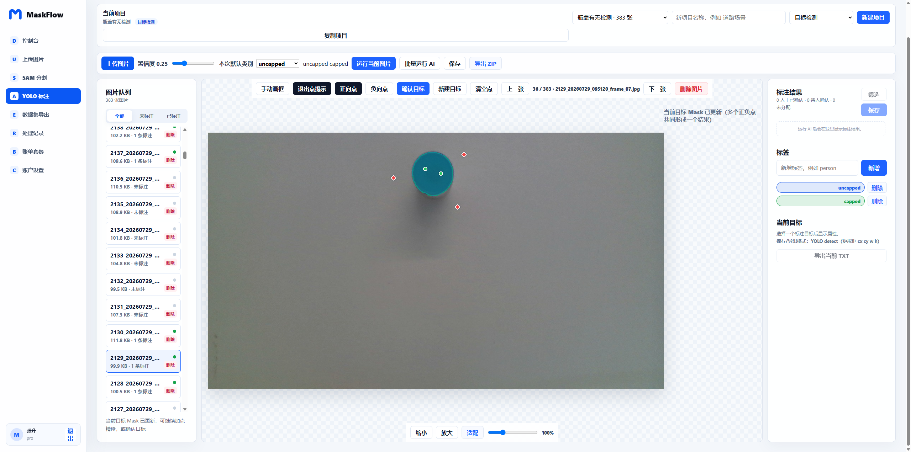

# MaskFlow

<p align="center"><strong><a href="./README.md">中文</a> · English</strong></p>

<p align="center"><strong>An end-to-end AI annotation workbench for turning raw images into training-ready datasets.</strong><br />Built with SAM 3, YOLO, Vue 3, ASP.NET Core, and FastAPI.</p>

<p align="center"><a href="https://github.com/Z18393520308/maskflow/actions/workflows/ci.yml"></a> <a href="./LICENSE"></a> <a href="https://github.com/Z18393520308/maskflow/releases"></a></p>

<p align="center"><a href="./docs/screenshots/yolo-annotation-workbench.png"></a></p>

<p align="center">Manage projects, run batch AI annotation, refine masks with positive and negative points, review labels, and export YOLO datasets from one workspace.</p>

<table>
  <tr><td width="50%" align="center"><strong>SAM 3 point-prompt segmentation</strong></td><td width="50%" align="center"><strong>Project dashboard</strong></td></tr>
  <tr><td><a href="./docs/screenshots/sam-point-prompt.png"></a></td><td><a href="./docs/screenshots/dashboard.png"></a></td></tr>
  <tr><td align="center"><strong>Batch image management</strong></td><td align="center"><strong>Dataset export</strong></td></tr>
  <tr><td><a href="./docs/screenshots/upload-manager.png"></a></td><td><a href="./docs/screenshots/dataset-export.png"></a></td></tr>
</table>

## Features

- **Project-based image management** — upload, download, delete, and inspect annotation status in batches.
- **SAM 3 segmentation** — automatic detection, text prompts, positive and negative points, and multi-object confirmation.
- **YOLO review** — automatic annotation, manual boxes, label management, filtering, and human confirmation.
- **Training dataset export** — YOLO detection, YOLO segmentation, or classification crops with train / val / test splits.
- **Task tracking** — processing history, AI usage quotas, and project-level statistics.
- **Self-hosted deployment** — Docker Compose runs the Vue frontend, .NET API, FastAPI inference service, MySQL, and MinIO.

## Quick start

### Prerequisites

- Docker Desktop or Docker Engine with Compose
- NVIDIA GPU, compatible driver, and NVIDIA Container Toolkit for the full inference stack
- Approved SAM 3 model weights

> SAM 3 weights are not downloaded automatically. Request access from the [Meta SAM 3 Hugging Face page](https://huggingface.co/facebook/sam3), download `sam3.pt` after approval, and follow the model license terms.

### Clone and configure

```bash
git clone https://github.com/Z18393520308/maskflow.git
cd maskflow
cp .env.example .env
mkdir -p 资源/模型
# Copy sam3.pt to 资源/模型/sam3.pt
```

### Start the stack

```bash
docker compose up -d --build
docker compose ps
```

The first startup creates MySQL and API data volumes automatically. The default bindings use loopback addresses and do not expose services directly to a LAN or the public internet.

| Service | Local address | Description |
|---|---|---|
| Web | http://127.0.0.1:3000 | MaskFlow workbench |
| API | http://127.0.0.1:8000 | Business API |
| SAM | http://127.0.0.1:8001 | Inference service |
| MinIO Console | http://127.0.0.1:9001 | Object storage administration |
| MySQL | 127.0.0.1:3307 | Database |

## Architecture

```text
Browser (Vue 3 + Vite)
          │
          ▼
MaskFlow API (ASP.NET Core 9)
     │                 │
     ▼                 ▼
SAM inference      MySQL / MinIO
(FastAPI + GPU)    (data / object storage)
```

| Component | Stack | Directory |
|---|---|---|
| Web workbench | Vue 3, Vite, Nginx | `src/frontend/maskflow-web` |
| Business API | ASP.NET Core 9, MySqlConnector, ImageSharp | `src/backend/maskflow-api` |
| AI inference | FastAPI, Ultralytics, PyTorch, OpenCV | `src/ai/sam-inference` |
| Tests | xUnit, GitHub Actions | `src/backend/maskflow-api.tests`, `.github/workflows` |

## Local development

### Frontend

```bash
cd src/frontend/maskflow-web
npm ci
npm run dev -- --host 127.0.0.1 --port 3010
```

The development server proxies `/api` and `/v1` to `http://127.0.0.1:8010`.

### Backend and SAM inference

Run the API with `dotnet run --project src/backend/maskflow-api/MaskFlow.Api.csproj --urls http://127.0.0.1:8010`. Run the inference service with `python -m uvicorn app.main:app --host 127.0.0.1 --port 8001` from `src/ai/sam-inference` after installing `requirements.txt`.

Development Swagger UI: http://127.0.0.1:8010/swagger

## Production deployment

```bash
cp .env.production.example .env
docker compose config
docker compose up -d --build
```

Before starting production, replace every `replace-me` value with a separate high-entropy random secret, set both CORS variables to real HTTPS domains, put a TLS reverse proxy in front of Web, and keep SAM, MySQL, MinIO, and API on loopback or a controlled private network. Production mode rejects example/development secrets and disables `MASKFLOW_BILLING_DEV_MODE` and `MASKFLOW_PASSWORD_RESET_INLINE`.

## Main API routes

```text
POST /api/auth/register
POST /api/auth/login
POST /api/files/upload
POST /api/segment
POST /api/segment/points
POST /api/annotations/auto
POST /api/annotations/points
POST /api/export/dataset
GET  /api/tasks
GET  /api/ai/quota
```

See the development Swagger UI for the complete API reference.

## Repository layout

```text
maskflow/
├── .github/                    # CI and dependency updates
├── docs/screenshots/           # Product screenshots used in the README
├── src/frontend/maskflow-web/  # Vue workbench
├── src/backend/maskflow-api/   # .NET business API
├── src/ai/sam-inference/       # SAM 3 inference service
├── 文档/                       # Product and change records
├── 资源/模型/                  # Local model weights, excluded from Git
├── docker-compose.yml
└── LICENSE
```

## Testing and CI

Every commit and pull request runs frontend install/build and audit, backend xUnit tests, Python compilation checks, and `docker compose config --quiet`.

## Contributing

Issues, feature ideas, and pull requests are welcome. Before submitting a change, make sure CI passes and do not commit model weights, datasets, secrets, or local runtime files.

## License

MaskFlow is released under the [GNU Affero General Public License v3.0](./LICENSE). If you provide a modified MaskFlow service over a network, comply with the AGPL-3.0 source-availability requirements.
