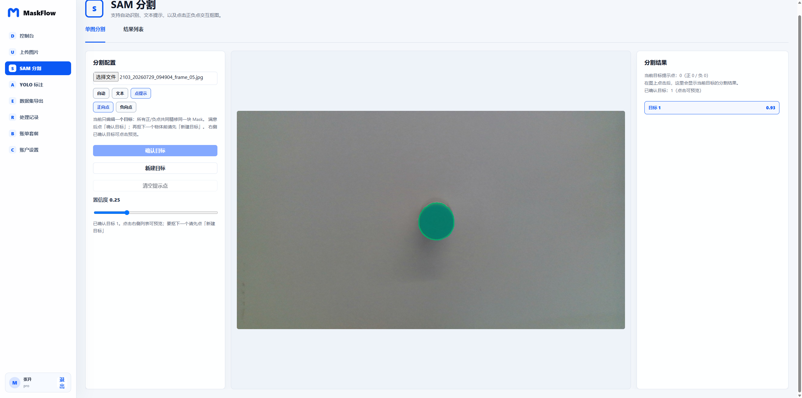
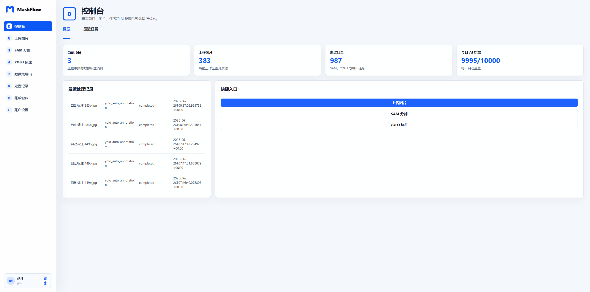
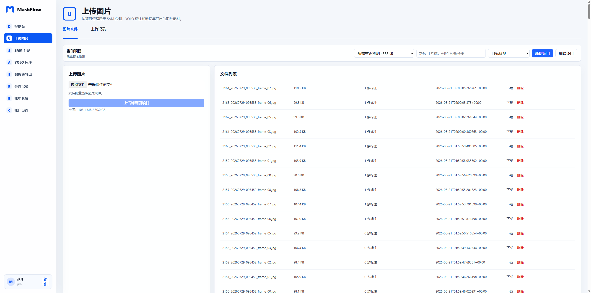
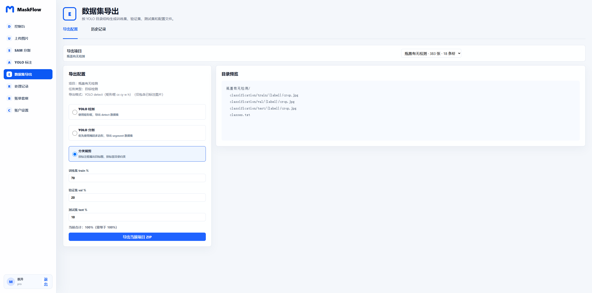

<div align="center">

# MaskFlow

**从原始图片到可训练数据集的一站式 AI 标注工作台**

基于 SAM 3、YOLO、Vue 3、ASP.NET Core 与 FastAPI，支持图片管理、智能分割、人工复核和数据集导出。

[](https://github.com/Z18393520308/maskflow/actions/workflows/ci.yml)
[](./LICENSE)
[](https://github.com/Z18393520308/maskflow/releases)
[](https://vuejs.org/)
[](https://dotnet.microsoft.com/)

</div>

<p align="center">
  <a href="./docs/screenshots/sam-point-prompt.png">
    
  </a>
</p>

<p align="center">用正负点、文本或自动模式生成分割结果，在同一套工作流中完成标注复核与数据集导出。</p>

<table>
  <tr>
    <td width="33%" align="center"><strong>项目控制台</strong></td>
    <td width="33%" align="center"><strong>批量图片管理</strong></td>
    <td width="33%" align="center"><strong>多格式数据集导出</strong></td>
  </tr>
  <tr>
    <td><a href="./docs/screenshots/dashboard.png"></a></td>
    <td><a href="./docs/screenshots/upload-manager.png"></a></td>
    <td><a href="./docs/screenshots/dataset-export.png"></a></td>
  </tr>
</table>

## MaskFlow 能做什么

- **统一管理图片数据**：按项目批量上传、下载、删除和查看标注状态。
- **SAM 3 智能分割**：支持自动识别、文本提示、正负点交互和多目标确认。
- **YOLO 标注复核**：自动标注、手动画框、标签管理、筛选异常框并人工确认。
- **直接导出训练集**：支持 YOLO 检测、YOLO 分割和分类裁剪，自动划分 train / val / test。
- **完整任务追踪**：记录处理任务、AI 调用额度和项目级统计。
- **自托管部署**：Vue 前端、.NET API、FastAPI 推理、MySQL 与 MinIO 由 Docker Compose 统一管理。

## 快速开始

### 1. 准备环境

完整 AI 推理栈需要：

- Docker Desktop 或 Docker Engine + Compose
- NVIDIA GPU、驱动与 NVIDIA Container Toolkit
- 已获批的 SAM 3 模型权重

> SAM 3 权重不会自动下载。请先在 [Meta SAM 3 的 Hugging Face 页面](https://huggingface.co/facebook/sam3)申请访问，获批后下载 `sam3.pt`，并遵守模型页面上的许可条款。

### 2. 下载并配置

macOS、Linux 或 WSL：

```bash
git clone https://github.com/Z18393520308/maskflow.git
cd maskflow

cp .env.example .env
mkdir -p 资源/模型
# 将下载的 sam3.pt 放到 资源/模型/sam3.pt
```

Windows PowerShell：

```powershell
git clone https://github.com/Z18393520308/maskflow.git
Set-Location maskflow

Copy-Item .env.example .env
New-Item -ItemType Directory -Force "资源/模型"
# 将下载的 sam3.pt 放到 资源/模型/sam3.pt
```

### 3. 一键启动

```bash
docker compose up -d --build
docker compose ps
```

首次启动会自动创建 MySQL 和 API 数据卷，不需要手动执行 `docker volume create`。

| 服务 | 本机地址 | 说明 |
|---|---|---|
| Web | http://127.0.0.1:3000 | MaskFlow 工作台 |
| API | http://127.0.0.1:8000 | 业务 API |
| SAM | http://127.0.0.1:8001 | 推理服务 |
| MinIO Console | http://127.0.0.1:9001 | 对象存储管理 |
| MySQL | 127.0.0.1:3307 | 数据库 |

默认配置仅绑定回环地址，不会直接暴露到局域网或公网。

## 技术架构

```text
浏览器（Vue 3 + Vite）
          │
          ▼
MaskFlow API（ASP.NET Core 9）
     │                 │
     ▼                 ▼
SAM 推理服务        MySQL / MinIO
（FastAPI + GPU）   （业务数据 / 对象存储）
```

| 组件 | 技术栈 | 目录 |
|---|---|---|
| Web 工作台 | Vue 3、Vite、Nginx | `src/frontend/maskflow-web` |
| 业务 API | ASP.NET Core 9、MySqlConnector、ImageSharp | `src/backend/maskflow-api` |
| AI 推理 | FastAPI、Ultralytics、PyTorch、OpenCV | `src/ai/sam-inference` |
| 自动化测试 | xUnit、GitHub Actions | `src/backend/maskflow-api.tests`、`.github/workflows` |

## 本地开发

### 前端

```bash
cd src/frontend/maskflow-web
npm ci
npm run dev -- --host 127.0.0.1 --port 3010
```

开发服务器会把 `/api` 和 `/v1` 代理到 `http://127.0.0.1:8010`。

### 后端

```bash
export MASKFLOW_MYSQL='Server=127.0.0.1;Port=3306;Database=maskflow;User ID=maskflow;Password=maskflow;Allow User Variables=true;'
dotnet run --project src/backend/maskflow-api/MaskFlow.Api.csproj --urls http://127.0.0.1:8010
```

Windows PowerShell 可使用：

```powershell
$env:MASKFLOW_MYSQL = "Server=127.0.0.1;Port=3306;Database=maskflow;User ID=maskflow;Password=maskflow;Allow User Variables=true;"
dotnet run --project src/backend/maskflow-api/MaskFlow.Api.csproj --urls http://127.0.0.1:8010
```

开发环境 Swagger：http://127.0.0.1:8010/swagger

### SAM 推理

```bash
cd src/ai/sam-inference
python -m venv .venv
source .venv/bin/activate
pip install -r requirements.txt
python -m uvicorn app.main:app --host 127.0.0.1 --port 8001
```

本地可以不设置内部密钥；设置 `SAM3_REQUIRE_INTERNAL_KEY=true` 时，必须同时提供 `SAM3_INTERNAL_KEY`，并让业务 API 使用相同密钥。

## 生产部署

```bash
cp .env.production.example .env
```

然后完成以下检查：

1. 替换所有 `replace-me` 值，使用独立的高强度随机密钥。
2. 将 `MASKFLOW_CORS_ORIGINS` 和 `SAM3_CORS_ORIGINS` 改为真实 HTTPS 域名。
3. 在 Web 服务前配置 TLS 反向代理。
4. 保持 SAM、MySQL、MinIO 和 API 监听在 `127.0.0.1` 或受控私有网络。
5. 执行 `docker compose config` 检查最终配置，再启动服务。

Production 模式会拒绝示例/开发密钥，并禁止 `MASKFLOW_BILLING_DEV_MODE` 和 `MASKFLOW_PASSWORD_RESET_INLINE`。

## 常用命令

```bash
# 启动或更新全部服务
docker compose up -d --build

# 只更新前端和 API
docker compose up -d --build web api

# 更新推理服务
docker compose up -d --build sam-inference

# 查看日志和状态
docker compose ps
docker compose logs -f api

# 停止服务（保留数据）
docker compose down
```

## 主要 API

```text
POST /api/auth/register
POST /api/auth/login
POST /api/files/upload
POST /api/segment
POST /api/segment/points
POST /api/annotations/auto
POST /api/annotations/points
POST /api/export/dataset
GET  /api/tasks
GET  /api/ai/quota
```

完整接口可在开发环境 Swagger 中查看。

## 项目结构

```text
maskflow/
├── .github/                    # CI 与依赖更新
├── docs/screenshots/           # README 产品截图
├── src/
│   ├── frontend/maskflow-web/  # Vue 工作台
│   ├── backend/maskflow-api/   # .NET 业务 API
│   ├── ai/sam-inference/       # SAM 3 推理服务
│   └── legacy/                 # 旧版实现，仅供参考
├── 文档/                       # 产品与修改记录
├── 资源/模型/                  # 本地模型权重，不纳入 Git
├── .env.example
├── .env.production.example
├── docker-compose.yml
└── LICENSE
```

## 测试与持续集成

每次提交和 Pull Request 都会运行：

```bash
npm ci
npm audit --audit-level=high
npm run build
dotnet test src/backend/maskflow-api.tests/MaskFlow.Api.Tests.csproj
python -m compileall -q src/ai/sam-inference/app
docker compose config --quiet
```

## 参与贡献

欢迎通过 [Issues](https://github.com/Z18393520308/maskflow/issues) 报告问题、提出功能建议，或提交 Pull Request。提交前请确保 CI 全部通过，并避免提交模型权重、数据集、密钥和本地运行文件。

## 许可证

MaskFlow 源代码采用 [GNU Affero General Public License v3.0](./LICENSE) 发布。通过网络提供修改后的 MaskFlow 服务时，请遵守 AGPL-3.0 的源码提供义务。

SAM 3 模型权重及其他第三方组件分别受其自身许可条款约束，详见 [第三方声明](./THIRD_PARTY_NOTICES.md)。
